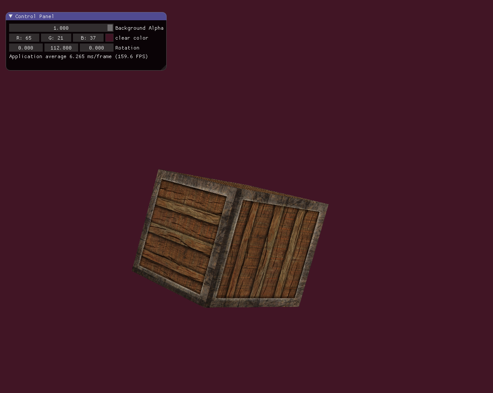

# Renderer
Welcome to my C++ OpenGL renderer! This repository contains the source code for a 
basic renderer engine that I've working on for the past couple of weeks while learning OpenGL.

This render is built using, or well, trying to at least, use modern C++ and 
modern OpneGL. I've included the complete source code.

This is still a work in progress.




# Build and execution
```shell
# Clone repository
git clone --recursive repo_url
cd Renderer

# Build application
mkdir build
cd build
cmake ..
cmake --build .

# Run application
./renderer
```