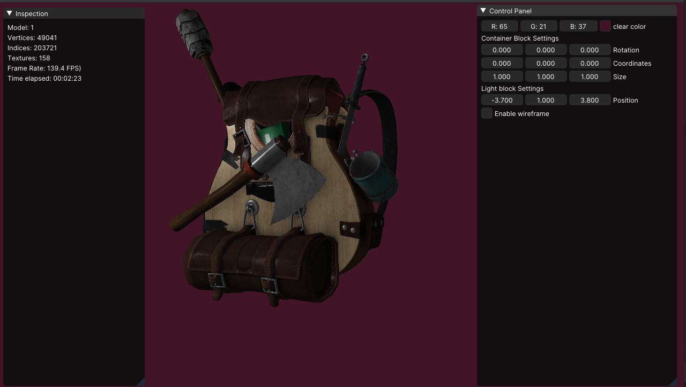

# OpenGL Renderer
Welcome to my C++ OpenGL renderer! This repository contains the source code for a 
basic 3D renderer that I've worked on while learning OpenGL.

This renderer is built using, or well, trying to at least, use modern C++ and 
modern OpenGL.

This is still a work in progress and is still somewhat buggy. On Linux you may miss some OpenGL library files
that need to be linked, a small setup script was provided [here](/setup) to get those.
The project requires also the following tools to build and run:

1. C++ compiler (A C++ 20 capable compiler, Gcc12 was used for tests)
2. CMake (Cross platform build system)



This project is done thanks to various open source libraries listed below:

1. [GLEW (Open GL extension Wrangler)](https://glew.sourceforge.net/)
2. [GLFW (Multiplatform Library for Window, Event handling, etc.)](https://github.com/glfw/glfw)
3. [GLM (Open GL Mathematics Library for C++)](https://github.com/g-truc/glm)
4. [ImGui (Graphical User interface Library for C++)](https://github.com/ocornut/imgui)
5. [Spdlog (Fast C++ Logging Library)](https://github.com/gabime/spdlog)

# Build and execution
Some steps on how to build and run on linux.
Same commands should work on Windows PowerShell and .
```shell
# Clone repository
git clone --recursive https://github.com/kateBea/Renderer.git
cd Renderer

# Build application
mkdir build && cd build
cmake .. && cmake --build .

# Run application
./modelLoading
```
